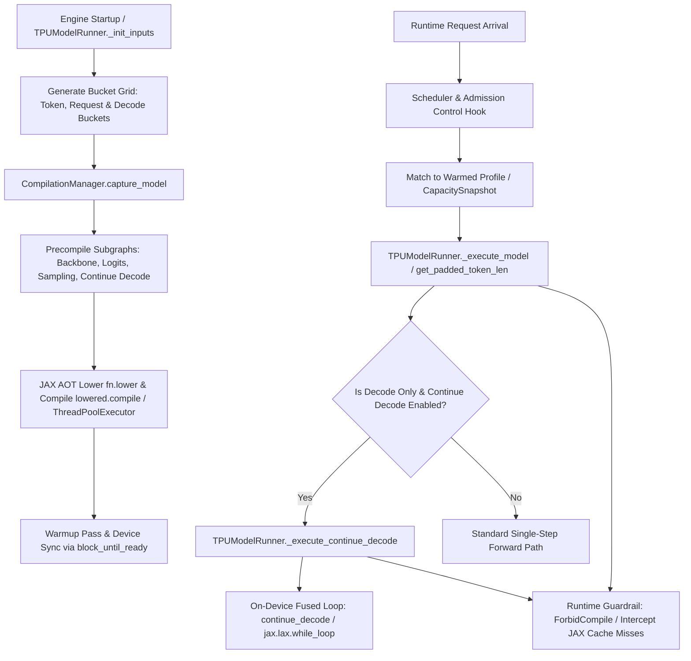

# Technical Report: vLLM Batch Size & Output Length Precompilation Analysis

## Executive Summary

In high-performance Large Language Model (LLM) serving on Google TPUs with XLA (Accelerated Linear Algebra), dynamic input shapes trigger expensive runtime Just-In-Time (JIT) compilations ("compilation storms"). To guarantee predictable sub-millisecond execution overhead, `vllm` within `admission-control-vllm` (specifically `tpu-inference`) implements an Ahead-Of-Time (AOT) precompilation architecture via the `CompilationManager`.

This report provides an end-to-end, detailed codepath breakdown of how different batch sizes, sequence token counts, and generation output lengths (decode steps) are bucketed, precompiled at engine startup, matched at runtime, interacts directly with JAX/XLA APIs, and is gated by Admission Control.

---

## Architecture Overview



Execution graphs on TPU are parameterized across three primary dimensional axes:
1. **Token Bucket (`num_tokens_paddings`)**: Total batched input tokens across the Data Parallel (DP) rank.
2. **Batch Size / Request Bucket (`num_reqs_paddings` & `attn_num_reqs_paddings`)**: Active concurrent request slots.
3. **Output Length / Decode Steps (`max_decode_steps`)**: Multi-step generation bounds executed directly on-device via `continue_decode`.

---

## 1. Bucketing Strategy & Dimension Math

The bucket grid is computed during runner initialization in [`tpu-inference/tpu_inference/runner/tpu_runner.py#L1018-L1150`](tpu-inference/tpu_inference/runner/tpu_runner.py#L1018-L1150) and helper utilities in [`tpu-inference/tpu_inference/runner/utils.py#L148-L215`](tpu-inference/tpu_inference/runner/utils.py#L148-L215).

### A. Token Buckets (`num_tokens_paddings`)
Calculated by [`runner_utils.get_token_paddings()`](tpu-inference/tpu_inference/runner/utils.py#L180-L211):
- **Min Token Size**: `max(MIN_TOKEN_BUCKET, next_power_of_2(dp_size * kv_packing))`
- **Max Token Size**: `max_num_batched_tokens * dp_size`
- **Padding Gap**: Controlled by `VLLM_TPU_BUCKET_PADDING_GAP`.
  - **Exponential Mode (`gap == 0`)**: Powers of 2 ($16, 32, 64, 128, \dots$).
  - **Linear Gap Mode (`gap > 0`)**: Powers of 2 up to `padding_gap`, then linear step increments of `padding_gap` (e.g., $+256$).
- Custom additional sizes can be injected via `compilation_sizes` in `additional_config`.
- Per-DP rank padding list: `self.num_tokens_paddings_per_dp = [p // dp_size for p in num_tokens_paddings]`.

### B. Batch Size / Request Buckets (`num_reqs_paddings` & `attn_num_reqs_paddings`)
Calculated by [`runner_utils.get_req_paddings()`](tpu-inference/tpu_inference/runner/utils.py#L148-L157) and [`get_attn_req_paddings()`](tpu-inference/tpu_inference/runner/utils.py#L160-L177):
- **Request Padding**: Power-of-two progression from `min_num_reqs` ($\max(\text{MIN\_NUM\_SEQS}, 2^{\lceil \log_2(\text{dp\_size}) \rceil})$) up to `max_num_reqs` ($\max(\text{dp\_size} \times \text{max\_num\_seqs}, \text{MIN\_NUM\_SEQS})$).
- **Attention Request Buckets**: Controlled by `ATTN_BUCKETIZED_NUM_REQS` or explicit overrides `ATTN_CUSTOM_NUM_REQS_BUCKETS`.

### C. Output Length / Decode Step Bounds (`max_decode_steps`)
- Multi-step output generation bypasses per-step host-device roundtrips using `enable_continue_decode`.
- Configured by `max_decode_steps` in `additional_config` (defaults to `DEFAULT_MAX_DECODE_STEPS`, e.g., 64).
- Graph precompilation binds statically to `static_max_decode_steps` while runtime dynamic steps pass `max_decode_steps_arr` (a JAX scalar array) into `jax.lax.while_loop`.

---

## 2. Detailed Codepath Trace

### Phase 1: Engine Initialization & Bucket Derivation
- **File**: [`tpu-inference/tpu_inference/runner/tpu_runner.py#L1018-L1120`](tpu-inference/tpu_inference/runner/tpu_runner.py#L1018-L1120)
- Computes `num_tokens_paddings`, `num_reqs_paddings`, `attn_num_reqs_paddings`, and `max_num_reqs`.
- Instantiates `InputBatch` allocated to `max_num_tokens` and `max_num_reqs`.

```python
self.num_tokens_paddings = runner_utils.get_token_paddings(
    min_token_size=max(envs.MIN_TOKEN_BUCKET, next_power_of_2(self.dp_size * kv_packing)),
    max_token_size=scheduler_config.max_num_batched_tokens * self.dp_size,
    padding_gap=vllm_envs.VLLM_TPU_BUCKET_PADDING_GAP
)
self.num_reqs_paddings = runner_utils.get_req_paddings(
    min_req_size=min_num_reqs, max_req_size=self.max_num_reqs
)
self.attn_num_reqs_paddings_per_dp = runner_utils.get_attn_req_paddings(
    min_req_size=MIN_NUM_SEQS, max_req_size=scheduler_config.max_num_seqs
)
```

### Phase 2: AOT Graph Capture & Parallel Precompilation
- **File**: [`tpu-inference/tpu_inference/runner/compilation_manager.py#L213-L273`](tpu-inference/tpu_inference/runner/compilation_manager.py#L213-L273)
- Iterates over all dimensional variants and subgraphs:

#### 1. Text Backbone Subgraph Precompilation
- **Method**: [`_precompile_backbone_text_only()`](tpu-inference/tpu_inference/runner/compilation_manager.py#L614-L661)
- Double nested loop over token buckets and request buckets:
```python
for num_tokens in self.runner.num_tokens_paddings:
    for num_reqs in self.runner.attn_num_reqs_paddings:
        # Construct dummy input tensors of shape (num_tokens,)
        input_ids = self._create_dummy_tensor((num_tokens,), jnp.int32, dp_sharding)
        positions = self._create_dummy_tensor((num_tokens,), jnp.int32, dp_sharding)
        self._precompile_backbone_helper(
            f"worker{self.runner.rank} backbone",
            input_ids=input_ids,
            positions=positions,
            num_reqs=num_reqs
        )
```
- Calls [`_run_compilation()`](tpu-inference/tpu_inference/runner/compilation_manager.py#L125-L177) which lowers the graph (`fn.lower(*args)`) and submits background compilation tasks to `ThreadPoolExecutor` (`NUM_PRECOMPILE_WORKERS`).
- Executes [`_flush_compilations()`](tpu-inference/tpu_inference/runner/compilation_manager.py#L179-L211) to await futures and run a device warmup pass with `block_until_ready()`.

#### 2. Multi-Step Continue Decode Loop Precompilation
- **Method**: [`_precompile_continue_decode()`](tpu-inference/tpu_inference/runner/compilation_manager.py#L1828-L2012)
- Precompiles multi-step decode loop for each batch size (`num_reqs` in `num_reqs_paddings`):
```python
user_max_decode_steps = self.runner.vllm_config.additional_config.get("max_decode_steps", DEFAULT_MAX_DECODE_STEPS)
max_decode_steps_arr = jnp.array(user_max_decode_steps, dtype=jnp.int32)

for num_reqs in self.runner.num_reqs_paddings:
    init_tokens = self._create_dummy_tensor((num_reqs,), jnp.int32, dp_sharding)
    active_mask = self._create_dummy_tensor((num_reqs,), jnp.bool_, dp_sharding)
    
    self._run_compilation(
        f"worker{self.runner.rank} continue_decode_steps_{user_max_decode_steps}_reqs_{num_reqs}",
        continue_decode_wrapper,
        self.runner.state_leaves,
        self.runner.model_fn,
        self.runner.compute_logits_fn,
        sample,
        self.runner.mesh,
        sampling_metadata,
        init_state,
        self.runner.kv_caches,
        max_decode_steps_arr,
        user_max_decode_steps,
        ...
    )
```

---

### Phase 3: Runtime Execution & Bucket Matching
- **File**: [`tpu-inference/tpu_inference/runner/tpu_runner.py#L2380-L2410`](tpu-inference/tpu_inference/runner/tpu_runner.py#L2380-L2410)
- Reads actual batch token/request counts from `VllmSchedulerOutput`:

```python
max_num_scheduled_tokens_across_dp = max(num_scheduled_tokens_per_dp_rank.values())
max_num_reqs_across_dp = max(len(req_ids) for req_ids in req_ids_dp.values())
is_decode_only = (self.input_batch.request_distribution[0] == self.input_batch.num_reqs)

# Match request bucket
padded_num_reqs_per_dp_rank = runner_utils.get_padded_token_len(
    self.num_reqs_paddings_per_dp, max_num_reqs_across_dp
)

# Match token bucket (or request bucket if continue_decode)
if is_decode_only and self.enable_continue_decode:
    padded_num_scheduled_tokens_per_dp_rank = padded_num_reqs_per_dp_rank
else:
    padded_num_scheduled_tokens_per_dp_rank = runner_utils.get_padded_token_len(
        self.num_tokens_paddings_per_dp, max_num_scheduled_tokens_across_dp
    )
```
- [`get_padded_token_len()`](tpu-inference/tpu_inference/runner/utils.py#L214-L220) uses binary search (`bisect_left`) to select the smallest precompiled bucket size $\ge$ current required size.
- Inputs are padded with dummy values up to the matched bucket shape.

---

### Phase 4: Fused On-Device Multi-Step Decode Loop
- **File**: [`tpu-inference/tpu_inference/runner/tpu_runner.py#L1730-L1805`](tpu-inference/tpu_inference/runner/tpu_runner.py#L1730-L1805) & [`tpu-inference/tpu_inference/runner/decode_loop.py#L327-L520`](tpu-inference/tpu_inference/runner/decode_loop.py#L327-L520)
- Calculates maximum available steps before KV cache block boundaries:
```python
min_remaining = self._get_min_remaining_slots()
max_decode_steps = min(self.static_max_decode_steps, min_remaining)
max_decode_steps_arr = jnp.array(max_decode_steps, dtype=jnp.int32)
```
- Executes [`_decode_core()`](tpu-inference/tpu_inference/runner/decode_loop.py#L180-L320), invoking `jax.lax.while_loop`:
```python
def cond_fn(carry):
    i = carry[0]
    eos_flag = carry[-1]
    not_done = i < max_decode_steps
    return jnp.logical_and(not_done, jnp.logical_not(eos_flag))

final_carry = jax.lax.while_loop(cond_fn, body_fn, init_carry)
```
- KV cache updates and token sampling occur entirely on TPU HBM without host CPU intervention for up to `max_decode_steps`.

---

## 3. Deep Dive: Interaction with JAX & XLA Engine

The `CompilationManager` acts as the orchestrator between vLLM's high-level execution specifications and JAX/XLA's low-level compilation pipeline.

### A. Persistent Compilation Cache Setup
During `CompilationManager.__init__` ([`tpu-inference/tpu_inference/runner/compilation_manager.py#L63-L72`](tpu-inference/tpu_inference/runner/compilation_manager.py#L63-L72)), vLLM configures JAX to persist all compiled HLO artifacts to disk so subsequent process restarts skip re-compilation:

```python
# Enable JAX disk cache
jax.config.update("jax_compilation_cache_dir", vllm_envs.VLLM_XLA_CACHE_PATH)

# Force caching even small functions/kernels by disabling size & time minimums
if vllm_envs.VLLM_XLA_CHECK_RECOMPILATION:
    jax.config.update("jax_persistent_cache_min_entry_size_bytes", -1)
    jax.config.update("jax_persistent_cache_min_compile_time_secs", -1)
```

### B. Multi-Threaded Parallel AOT Lowering & Compilation
To compile multiple bucket shapes efficiently without blocking the main Python thread sequentially, vLLM uses a two-stage AOT pipeline ([`tpu-inference/tpu_inference/runner/compilation_manager.py#L125-L178`](tpu-inference/tpu_inference/runner/compilation_manager.py#L125-L178)):

1. **Lowering to HLO IR (`fn.lower(*args)`)**:
   Dummy input arrays are instantiated with explicit mesh sharding (`NamedSharding`, `PartitionSpec`, `jax.set_mesh`). JAX traces the Python code into a **JAXpr** and lowers it into an **HLO Module**:
   ```python
   lowered = fn.lower(*args, **call_kwargs)
   ```

2. **Compilation to TPU Executable (`lowered.compile()`)**:
   The HLO module is compiled into a hardware-native TPU executable binary by invoking the XLA compiler backend:
   ```python
   def _compile(lowered, name, mesh):
       with jax.set_mesh(mesh):
           start = time.perf_counter()
           compiled = lowered.compile()  # Triggers XLA compilation pipeline
           return compiled

   # Submit to background thread pool
   future = self._compile_executor.submit(_compile, lowered, log_name, self.runner.mesh)
   self._compile_futures.append(future)
   ```

> **Stack Overflow Mitigation**: LLM graphs are exceptionally large. Linux's default 8 MB stack size would overflow during XLA lowering. `CompilationManager` explicitly bumps the worker thread stack size to **64 MB**:
> ```python
> threading.stack_size(64 * 1024 * 1024)
> self._compile_executor = ThreadPoolExecutor(max_workers=envs.NUM_PRECOMPILE_WORKERS)
> ```

### C. Device Warmup & Hardware Synchronization (`block_until_ready`)
After compilation completes, `_flush_compilations()` ([`tpu-inference/tpu_inference/runner/compilation_manager.py#L179-L211`](tpu-inference/tpu_inference/runner/compilation_manager.py#L179-L211)) executes a warmup pass and synchronizes the TPU hardware:

```python
with jax.set_mesh(self.runner.mesh):
    for name, fn, args, call_kwargs, warmup_handler in tasks:
        out = fn(*args, **call_kwargs) if warmup_handler is None else warmup_handler(fn, args, call_kwargs)
        # Block host execution until TPU hardware finishes kernel execution
        jax.tree.map(lambda r: r.block_until_ready(), out)
```
- **Why `block_until_ready()` is critical**: JAX uses asynchronous execution dispatch. Calling `block_until_ready()` ensures that XLA executable binaries are completely loaded, initialized, and synchronized on the TPU chip before accepting user requests.

### D. Zero-Runtime-Compilation Guardrail (`ForbidCompile`)
To ensure that no request triggers an unplanned JIT compile on the serving hot path, vLLM wraps inference execution in `ForbidCompile` ([`tpu-inference/tpu_inference/runner/utils.py#L240-L291`](tpu-inference/tpu_inference/runner/utils.py#L240-L291)), which monkey-patches JAX's internal `pxla._cached_lowering_to_hlo`:

```python
class ForbidCompile:
    def __enter__(self):
        self._original_func = pxla._cached_lowering_to_hlo

        @functools.wraps(self._original_func)
        def wrapper(*args, **kwargs):
            misses_before = self._original_func.cache_info().misses
            result = self._original_func(*args, **kwargs)
            misses_after = self._original_func.cache_info().misses
            
            # If JAX lowers a new shape (cache miss), raise RuntimeError immediately
            if misses_after > misses_before:
                raise RuntimeError("JAX compilation occurred but was forbidden in this context.")
            return result

        pxla._cached_lowering_to_hlo = wrapper
```
If an uncompiled shape arrives during inference, JAX triggers a cache miss inside `_cached_lowering_to_hlo`, which immediately aborts the step with a `RuntimeError` rather than allowing a multi-second inline compilation to stall serving latency.

---

## 4. Key `@jax.jit` Functions Inventory in `tpu-inference`

The following table inventories the core `@jax.jit`-annotated functions in `tpu-inference` that form the precompiled execution pipeline:

| Precompiled Function / Operator | File Location | Decorator / JAX Signature | Precompilation Codepath |
|---|---|---|---|
| **`run_model` / `step_fn`** (Backbone) | [`tpu_inference/models/common/model_loader.py#L375`](tpu-inference/tpu_inference/models/common/model_loader.py#L375) | `@jax.jit(out_shardings=(...))` | Precompiled in [`_precompile_backbone_text_only()`](tpu-inference/tpu_inference/runner/compilation_manager.py#L614) over `num_tokens_paddings` & `attn_num_reqs_paddings`. |
| **`run_compute_logits`** | [`tpu_inference/models/common/model_loader.py#L412`](tpu-inference/tpu_inference/runner/model_loader.py#L412) | `@jax.jit(out_shardings=(logits_sharding))` | Precompiled in [`_precompile_compute_logits()`](tpu-inference/tpu_inference/runner/compilation_manager.py#L842) over `num_tokens_paddings`. |
| **`jitted_embed_input_ids`** | [`tpu_inference/models/common/model_loader.py#L428`](tpu-inference/tpu_inference/runner/model_loader.py#L428) | `@jax.jit(out_shardings=(embed_sharding))` | Precompiled in [`_precompile_backbone_with_inputs_embeds()`](tpu-inference/tpu_inference/runner/compilation_manager.py#L663). |
| **`continue_decode`** | [`tpu_inference/runner/decode_loop.py#L327`](tpu-inference/tpu_inference/runner/decode_loop.py#L327) | `jax.lax.while_loop` inside JIT wrapper | Precompiled in [`_precompile_continue_decode()`](tpu-inference/tpu_inference/runner/compilation_manager.py#L1828) for each `num_reqs` & `user_max_decode_steps`. |
| **`sample` / `_sample_from_logits`** | [`tpu_inference/runner/tpu_runner.py#L2252`](tpu-inference/tpu_inference/runner/tpu_runner.py#L2252) | `@functools.partial(jax.jit, static_argnums=(2,))` | Precompiled in [`_precompile_sampling()`](tpu-inference/tpu_inference/runner/compilation_manager.py#L879). |
| **`substitute_placeholder_token`** | [`tpu_inference/runner/tpu_runner.py#L539`](tpu-inference/tpu_inference/runner/tpu_runner.py#L539) | `@jax.jit(donate_argnums=(0, 1, 2))` | Precompiled in [`_precompile_substitute_placeholder_token()`](tpu-inference/tpu_inference/runner/compilation_manager.py#L482). |
| **`structured_decode_fn`** | [`tpu_inference/runner/structured_decoding_manager.py#L33`](tpu-inference/tpu_inference/runner/structured_decoding_manager.py#L33) | `@jax.jit(static_argnums=(0,))` | Precompiled in [`_precompile_structured_decoding()`](tpu-inference/tpu_inference/runner/compilation_manager.py#L1795). |
| **`allocate_kv_cache`** | [`tpu_inference/runner/kv_cache.py#L110`](tpu-inference/tpu_inference/runner/kv_cache.py#L110) | `@partial(jax.jit, out_shardings=sharding)` | Precompiled during runner KV initialization for paged block tables. |

---

## 5. Admission Control & Capacity Integration

The native admission control framework documented in [`tpu-inference/docs/developer_guides/native_request_admission_and_migration_v2.md`](tpu-inference/docs/developer_guides/native_request_admission_and_migration_v2.md) and [`tpu-inference/docs/developer_guides/tpu_migration_xla_engineering_plan.md`](tpu-inference/docs/developer_guides/tpu_migration_xla_engineering_plan.md) interfaces directly with precompiled buckets:

1. **CapacitySnapshot Advertisement**:
   - `CapacitySnapshot` advertises `warmed_buckets` (the set of precompiled executable shape tuples: token count, batch size, attention layout, decode steps).
2. **Pre-Allocation Bounds Validation**:
   - For an incoming request with prompt length $P$ and max generation $N$, target token count is bounded:
     $$T = \min(P + N + L, \text{max\_model\_len})$$
   - The scheduler memory-admission hook checks whether reserving memory for $T$ fits within an advertised precompiled bucket tuple.
3. **Execution Guardrails**:
   - Requests that require shapes outside `warmed_buckets` are issued `DEFER` or `REROUTE_BEFORE_START` decisions rather than entering the execution queue.
   - If an uncompiled shape reaches execution, `maybe_forbid_compile` ([`tpu-inference/tpu_inference/runner/utils.py#L242-L291`](tpu-inference/tpu_inference/runner/utils.py#L242-L291)) asserts and fails to prevent dynamic compilation latency spikes.

---

## Summary Matrix of Precompiled Axes

| Axis | Calculation Method | File & Function | Codepath Role |
|---|---|---|---|
| **Token Padding** | `get_token_paddings(min_token, max_token, gap)` | [`tpu-inference/tpu_inference/runner/utils.py#L180`](tpu-inference/tpu_inference/runner/utils.py#L180) | Pads total batched input tokens per DP rank for backbone prefill & execution. |
| **Request Padding** | `get_req_paddings(min_req, max_req)` | [`tpu-inference/tpu_inference/runner/utils.py#L148`](tpu-inference/tpu_inference/runner/utils.py#L148) | Controls batch size bucket array for sequence tables, LoRA, and state buffers. |
| **Attention Bucket** | `get_attn_req_paddings(min_req, max_req)` | [`tpu-inference/tpu_inference/runner/utils.py#L160`](tpu-inference/tpu_inference/runner/utils.py#L160) | Restricts attention matrix shape variants to reduce total compilation combinations. |
| **Continue Decode** | `user_max_decode_steps` & `num_reqs` | [`tpu-inference/tpu_inference/runner/compilation_manager.py#L1828`](tpu-inference/tpu_inference/runner/compilation_manager.py#L1828) | Precompiles fused `jax.lax.while_loop` for multi-step decode per batch size bucket. |
| **Runtime Match** | `get_padded_token_len(paddings, actual_val)` | [`tpu-inference/tpu_inference/runner/utils.py#L214`](tpu-inference/tpu_inference/runner/utils.py#L214) | Binary searches padded bucket array and pads input tensors before JIT invocation. |
| **JAX/XLA AOT** | `fn.lower()` & `lowered.compile()` | [`tpu-inference/tpu_inference/runner/compilation_manager.py#L152-L166`](tpu-inference/tpu_inference/runner/compilation_manager.py#L152-L166) | Lowers JAXpr to HLO module and compiles HLO to TPU executable binary. |
| **Runtime Guard** | `ForbidCompile` monkey-patch | [`tpu-inference/tpu_inference/runner/utils.py#L240`](tpu-inference/tpu_inference/runner/utils.py#L240) | Intercepts JAX `pxla._cached_lowering_to_hlo` cache misses and aborts step. |
