# Architectural & Benchmarking Plan: vLLM Prefill-Decode (PD) Decoupling Strategy on Cloud TPU v5e

## Executive Summary
This document defines the complete engineering plan for **Prefill-Decode (PD) Decoupling & Disaggregation** for large language model inference (specifically **Gemma-4 31B**) on Cloud TPU v5e clusters.

The strategy addresses two core dimensions:
1. **Benchmark Decoupling**: A rigorous offline benchmarking methodology that strictly isolates compute-bound **Prefill timing** (via single-token prompt evaluations with multi-iteration averaging) from memory-bandwidth-bound **Decode timing** (via warm KV-cache autoregressive continuation across customized sequence lengths).
2. **Serving Architecture Disaggregation (PD Separation)**: An asynchronous disaggregated serving topology allocating **$2\times 4$ sub-meshes ($TP=8$)** to high-throughput prefill pools and **$4\times 4$ full clusters ($TP=16$)** to low-latency decode pools, bridged by high-speed KV cache streaming.

---

## 1. Physical Motivation & Mathematical Foundation

### 1.1 The Fundamental Impedance Mismatch
Prefill and Decode phases exhibit opposing computational characteristics:

```
+---------------------------------------------------------------------------------------------------+
| PREFILL PHASE: Compute-Bound                                                                      |
| - Primary Bottleneck: Peak Matrix Multiply FLOPs (197 TFLOPS/chip)                                |
| - Arithmetic Intensity: High (O(N) FLOPs/byte)                                                    |
| - Optimal Topology: TP=8 (2-Host 2x4 Sub-mesh)                                                    |
| - Why TP=8: Avoids 4-node optical ring AllReduce; yields +44.8% higher throughput per TPU chip.   |
+---------------------------------------------------------------------------------------------------+
                                                  |
                                                  | (KV Cache Transfer via Network / Host Memory)
                                                  v
+---------------------------------------------------------------------------------------------------+
| DECODE PHASE: Memory-Bandwidth-Bound (for BS <= 32) & Step-Latency-Bound                         |
| - Primary Bottleneck: HBM Read Bandwidth (819 GB/s per chip; 6.55 TB/s on 8 chips vs 13.1 TB/s)   |
| - Arithmetic Intensity: Low (O(1) FLOPs/byte at batch size 1)                                     |
| - Optimal Topology: TP=16 (4-Host 4x4 Torus) for low-latency interactive streaming (17.2 ms/tok)  |
|                     or TP=8 with high batch size (BS >= 64) for maximum batch generation.         |
+---------------------------------------------------------------------------------------------------+
```

### 1.2 Quantitative Comparison Matrix

| Dimension | Combined / Colocated Serving | Decoupled Serving (PD Disaggregated) |
| :--- | :--- | :--- |
| **Prefill Efficiency ($N=16k$)** | $1,666\text{ tok/s/chip}$ ($TP=16$) | **$2,412\text{ tok/s/chip}$** ($TP=8$, **$+44.8\%$**) |
| **Single-Stream TPOT ($BS=1$)** | $28.3\text{ ms/tok}$ ($TP=8$) or $17.2\text{ ms}$ ($TP=16$) | **$17.2\text{ ms/tok}$** (Decode pool on $TP=16$) |
| **Head-of-Line Blocking** | High (Long prompt freezes decode step) | **Zero** (Dedicated prefill and decode compute) |
| **HBM KV Cache Fragmentation** | Shared dynamic pool causes OOM/evictions | Dedicated decode buffer with static block pool |

---

## 2. Decoupled Offline vLLM Benchmark Methodology

### 2.1 Two-Phase Measurement Protocol

```mermaid
flowchart TD
    subgraph Phase 1: Isolated Prefill Benchmark
        A1[Initialize vLLM / JAX on Target Mesh] --> A2[Prepare Batch of Prompts: BS x Input_Len]
        A2 --> A3[Warmup Pass: max_tokens=1]
        A3 --> A4[Timed Repetitions: iters=5, max_tokens=1]
        A4 --> A5[Calculate: T_prefill = mean elapsed, Tok/s = BS*Input_Len / T_prefill]
    end

    subgraph Phase 2: Warm-KV Autoregressive Decode Benchmark
        B1[Retain / Pre-populate KV Cache from Phase 1] --> B2[Configure Decode Metadata: is_prompt=False, Output_Len=128]
        B2 --> B3[Warmup Decode Step: 1 iteration]
        B3 --> B4[Timed Decode Pass: iters=25, Output_Len=128]
        B4 --> B5[Calculate: T_step = elapsed / iters, TPOT = T_step, Tok/s = BS / T_step]
    end
```



### 2.2 Mathematical Formulations

1. **Pure Prefill Throughput**:
   $$\text{Throughput}_{\text{prefill}} = \frac{\text{Batch Size} \times \text{Prompt Length}}{T_{\text{prefill}}}$$

2. **Model FLOPs Utilization (MFU) for Prefill**:
   $$\text{MFU}_{\text{prefill}} = \frac{\text{Throughput}_{\text{prefill}} \times \text{FLOPs}_{\text{per\_token\_48L}}}{\text{Peak TFLOPS}_{\text{mesh}}}$$
   *For Gemma-4 31B: $\text{FLOPs}_{\text{per\_token\_48L}} = 39.637 \text{ GFLOPs}$, Peak TFLOPS on 8 chips = $1,576 \text{ TFLOPS}$.*

3. **Pure Decode Step Latency & TPOT**:
   $$T_{\text{step}}(BS) = \frac{T_{\text{decode\_total}}}{L_{\text{output}}}$$
   $$\text{TPOT} = T_{\text{step}}(BS) \quad \text{[ms per output token]}$$

4. **Effective HBM Bandwidth Utilization (Decode)**:
   $$\text{BW}_{\text{effective}}(BS) = \frac{\text{Model Weights Size (61.4 GB)} + \text{KV Cache Active Read Size}(BS)}{T_{\text{step}}(BS)}$$

---

## 3. Implementation Plan: Offline Benchmark Suite

### 3.1 Target Files & Scripts

```
admission-control-vllm/benchmarks/gemma4_31b_tpu_v5e/
├── e2e_serving/
│   ├── run_vllm_decoupled_prefill_decode_bench.py   # Main decoupled offline benchmark script
│   └── run_2x4_dynamic_batch_orchestrator.py        # Orchestrator with reverse control flow
├── reports/
│   ├── vllm_decoupled_prefill_decode_report.md      # Auto-generated comprehensive benchmark report
│   └── md_to_html.py                               # HTML renderer with base64 embedded figures
└── results/
    └── vllm_decoupled_prefill_decode_results.json   # Machine-readable output metrics
```

### 3.2 Script Architecture (`run_vllm_decoupled_prefill_decode_bench.py`)

1. **Topology Discovery & Mesh Binding**:
   * Uses `TPUTopologyDiscovery` (`pkg_util/tpu_topology.py`) to discover physical host coordinates and create a strictly contiguous 2-host $2\times 4$ placement group or 4-host $4\times 4$ mesh.
2. **Actor Lifecycle & JAX State Initialization**:
   * Launches `MultihostVllmWorker` actors on each physical node.
   * Loads Gemma-4 31B weights using `load_format="jax_dummy"` to ensure fast cold startup (< 10 seconds) without disk bottlenecks.
3. **Prefill Timing Loop**:
   * Sweeps batch sizes: $BS \in [1, 4, 8, 16, 32, 64, 128, 256]$ at prompt lengths $N \in [512, 1024, 2048, 4096, 8192]$.
   * Enforces asynchronous execution completion with `.block_until_ready()` on output tokens.
   * Records: `step_time_ms`, `throughput_tok_s`, `achieved_tflops`, `mfu_percent`.
4. **Decode Timing Loop**:
   * Sweeps batch sizes: $BS \in [1, 4, 8, 16, 32, 64, 128, 256]$ at output length $L_{\text{out}} = 128$.
   * Executes decode steps with warm KV cache (`is_prompt=False`).
   * Records: `step_time_ms`, `total_decode_s`, `decode_tok_s`, `tpot_ms`, `effective_hbm_bw_tb_s`.

---

## 4. Production Disaggregated Serving Architecture (PD Separation)

### 4.1 System Topology & Interconnect Architecture

```
                                  +-----------------------+
                                  | HTTP / gRPC Gateway   |
                                  |   (Admission Router)  |
                                  +-----------------------+
                                        /           \
               1. Prompt Requests     /               \  3. Generation Metadata
                                    v                   v
        +-----------------------------------+   +-----------------------------------+
        |       PREFILL WORKER POOL         |   |        DECODE WORKER POOL         |
        |  Topology: 2x4 Subslice (TP=8)    |   |  Topology: 4x4 Cluster (TP=16)   |
        |  Compute: 1,576 TFLOPS            |   |  Compute: 3,152 TFLOPS            |
        |  Characteristics:                 |   |  Characteristics:                 |
        |   - Optimized for large GEMMs     |   |   - High aggregate HBM BW (13 TB/s)|
        |   - Low ICI collective hops       |   |   - Low interactive TPOT (17ms)   |
        |   - Max prompt throughput         |   |   - High concurrent sequence pool |
        +-----------------------------------+   +-----------------------------------+
                          \                               ^
                           \                             /
                            \---[ 2. KV Cache Stream ]--/
                                 via gRPC / Host RAM / NIX
```

### 4.2 KV Cache Transfer Protocol
1. **Prefill Phase**:
   * The Prefill worker computes key-value states for all prompt tokens ($384\text{ KB/token}$ for Gemma-4 31B).
   * Key-value tensors are copied directly from TPU HBM to Host RAM via asynchronous DMA.
2. **Transfer Bridge**:
   * KV blocks are transmitted to the target Decode Worker's Host RAM over high-speed node networking (gRPC / TCP direct / Ray Object Store).
3. **Decode Ingestion**:
   * The Decode worker loads KV blocks into its PagedAttention HBM memory pool.
   * Generation proceeds seamlessly from step 1 without re-computing the prompt.

---

## 5. Verification & Rollout Plan

### Phase 1: Benchmark Harness Validation
- [ ] Implement `run_vllm_decoupled_prefill_decode_bench.py` with standalone CLI flags (`--tp-size`, `--prompt-len`, `--output-len`, `--batch-sizes`).
- [ ] Verify `TPUTopologyDiscovery` creates the correct placement group on 2-host $2\times 4$ subslice.
- [ ] Run test execution with $BS=[1, 4]$ to verify prefill `.block_until_ready()` and decode timing accuracy.

### Phase 2: Complete Experimental Sweep
- [ ] Execute full sweep on 2-host ($TP=8$) subslice across $BS \in [1, 4, 8, 16, 32, 64, 128, 256]$.
- [ ] Execute comparative sweep on 4-host ($TP=16$) cluster across matching configurations.
- [ ] Export raw metrics to `results/vllm_decoupled_prefill_decode_results.json`.

### Phase 3: Reporting & Disaggregation Analysis
- [ ] Generate comprehensive markdown report `reports/vllm_decoupled_prefill_decode_report.md`.
- [ ] Render self-contained Google-Docs-compatible HTML report via `md_to_html.py`.
- [ ] Document ROI and cost-per-token savings of the $2\times 4$ Prefill + $4\times 4$ Decode disaggregated architecture.
