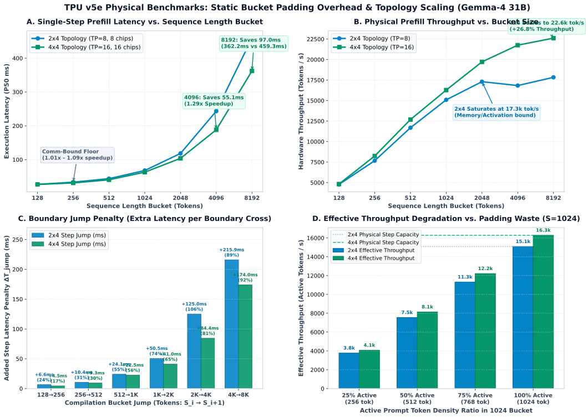

# Physical Experiment Specification: Static Padding Overhead and Bucket Compilation under TPU Topology Variations

## 1. Overview and Core Motivation

In distributed LLM serving systems on Google Cloud TPU v5e (e.g., vLLM with XLA), the XLA compiler relies on **static computation graphs**. To support variable-length prompt inputs and dynamic concurrent batching without incurring runtime recompilation, serving frameworks precompile a discrete grid of **sequence length buckets**:
$$\mathcal{S} = [128, 256, 512, 1024, 2048, 4096, 8192]$$

Any request whose token length falls within the open interval $(S_i, S_{i+1}]$ must be padded (ceil-padded) to the next compilation bucket $S_{i+1}$. This experiment quantifies the physical hardware cost of this static padding mechanism under two distinct TPU interconnect topologies: **$2\times 4$ (8 chips, TP=8)** and **$4\times 4$ (16 chips, TP=16)**. We measure the discrete latency step penalties (Bucket Jump Penalty) caused by boundary crossing and analyze how inter-host communication scales with topology size.

---

## 2. Hardware Topologies and Interconnect Characteristics

### 2.1 Physical Cluster Environment
- **Accelerator Specification**: Google Cloud TPU v5e (197 TFLOPS BF16 peak matrix compute per chip, 819 GB/s HBM bandwidth, 16 MB VMEM).
- **Physical Rack**: TPU-v5litepod-16 (4 physical hosts, each equipped with 4 TPU v5e chips, connected via intra-chassis and inter-chassis high-speed Inter-Chip Interconnect (ICI) in a 2D Torus mesh).

### 2.2 Topology Comparison Matrix

| Dimension | $2\times 4$ Topology (Subslice) | $4\times 4$ Topology (Full Pod) |
| :--- | :--- | :--- |
| **Total Chips / Physical Hosts** | 8 chips / 2 physical hosts | 16 chips / 4 physical hosts |
| **Tensor Parallelism (TP) Degree** | $\text{TP}=8$ (spans 2 hosts) | $\text{TP}=16$ (spans 4 hosts) |
| **Network Diameter & ICI Hops** | ICI single-ring / bidirectional adjacent hops $\le 2$ | 2D Torus ring hops $\le 4$, cross-host hops doubled |
| **AllReduce Communication Latency** | Lower (localized inter-host ring transfer) | Higher (increased inter-host ICI hops, higher baseline synchronization floor) |
| **Theoretical Peak Compute** | $8 \times 197 = 1,576\text{ TFLOPS}$ | $16 \times 197 = 3,152\text{ TFLOPS}$ |

---

## 3. Physical Causes of Padding Overhead and Mathematical Modeling

### 3.1 Single-Step Prefill Latency Decomposition Model
During the prefill phase, single-step execution time $T_{\text{step}}$ is composed of compute latency and inter-chip collective communication latency:
$$T_{\text{step}}(S, B) = T_{\text{GEMM}}(S, B) + T_{\text{Attn}}(S, B) + T_{\text{Comm}}(S, B)$$

- **GEMM Compute Consumption**: Matrix multiplications across all transformer layers (QKV, O-proj, Gate/Up/Down MLP) scale as:
  $$\text{FLOPs}_{\text{GEMM}} \approx 2 \cdot N_{\text{layers}} \cdot B \cdot S \cdot (4 \cdot d^2 + 3 \cdot d \cdot d_{\text{ffn}})$$
  Padding tokens linearly inflate the GEMM computational requirement.
- **Attention Compute Consumption**: Prefill causal self-attention scales as $O(B \cdot S^2 \cdot d)$.
- **ICI AllReduce Communication Consumption**:
  Each transformer layer requires 2 inter-chip AllReduce operations (following Attention output and FFN output), exchanging tensors of shape $[B, S, d]$.
  Under the Ring AllReduce algorithm, single-step transfer latency is modeled as:
  $$T_{\text{Comm}}(S, B) \approx 2 \cdot N_{\text{layers}} \cdot \left[ 2 \cdot \frac{\text{TP}-1}{\text{TP}} \cdot \alpha_{\text{latency}} + \frac{2 \cdot (\text{TP}-1)}{\text{TP}} \cdot \frac{2 \cdot B \cdot S \cdot d}{\text{BW}_{\text{ICI}}} \right]$$
  where $\alpha_{\text{latency}}$ is physical single-hop network latency and $\text{BW}_{\text{ICI}}$ is interconnect bandwidth. In the $4\times 4$ topology with $\text{TP}=16$, inter-host hops and synchronization latency terms increase significantly.

### 3.2 Bucket Jump Penalty
Let $L$ denote the actual prompt length. If $S_i < L \le S_{i+1}$, the input must be padded to $S_{i+1}$.
The boundary jump penalty is defined as the extra latency incurred by a request immediately exceeding $S_i$ (e.g., $L = S_i + 1$) when forced to pad to $S_{i+1}$:
$$\Delta T_{\text{jump}}(S_i \to S_{i+1}) = T_{\text{step}}(S_{i+1}) - T_{\text{step}}(S_i)$$
Relative penalty overhead:
$$\text{Overhead}_{\text{rel}} = \frac{T_{\text{step}}(S_{i+1}) - T_{\text{step}}(S_i)}{T_{\text{step}}(S_i)} \times 100\%$$

### 3.3 Topology Amplification Factor
To quantify whether larger topologies amplify padding latency penalties, define the topology amplification ratio $\Gamma$:
$$\Gamma(S_i \to S_{i+1}) = \frac{\left( \frac{T_{\text{step}, 4\times 4}(S_{i+1})}{T_{\text{step}, 4\times 4}(S_i)} \right)}{\left( \frac{T_{\text{step}, 2\times 4}(S_{i+1})}{T_{\text{step}, 2\times 4}(S_i)} \right)}$$
When $\Gamma > 1$, padding invalid tokens introduces network communication overhead that outstrips compute gains on $4\times 4$, indicating higher priority for fine-grained compilation buckets on larger topologies.

---

## 4. Experimental Test Matrix and Controlled Variables

### 4.1 Target Model
- **Model**: `Gemma-4 31B` (weights located at `/models/gemma-4-31b`).
- **Architectural Specifications**: 48 layers, Hidden Size = 5376, Intermediate Size = 21504 (or 14336), Heads = 32 Q / 16 KV, Head Dim = 128.
- **Data Type**: `bfloat16`.

### 4.2 Test Parameter Matrix

1. **Standard Compilation Bucket Baseline**:
   - Bucket set: $S \in [128, 256, 512, 1024, 2048, 4096, 8192]$.
   - Objective: Measure physical step latency and throughput baseline for each static shape across both topologies.
2. **Boundary Jump Testing**:
   - Transition points:
     - $128 \to 256$ (129 active tokens, 127 padded tokens, 50.4% padding ratio)
     - $256 \to 512$ (257 active tokens, 255 padded tokens, 50.2% padding ratio)
     - $512 \to 1024$ (513 active tokens, 511 padded tokens, 50.1% padding ratio)
     - $1024 \to 2048$ (1025 active tokens, 1023 padded tokens, 50.0% padding ratio)
     - $2048 \to 4096$ (2049 active tokens, 2047 padded tokens, 50.0% padding ratio)
     - $4096 \to 8192$ (4097 active tokens, 4095 padded tokens, 50.0% padding ratio)
3. **Padding Density Sweep (Fixed Bucket)**:
   - Under baseline bucket $S=1024$, active token ratio set to 25% (256), 50% (512), 75% (768), 100% (1024).
   - Measure divergence between effective throughput (active tokens/s) and physical iteration time.
4. **Batch Sizes**:
   - $B=1$ (single-request latency-sensitive regime, isolating network communication overhead from compute saturation);
   - $B=4$ (concurrent regime, evaluating combined scaling of compute and collective communication).

---

## 5. Execution Workflow and Verification Protocols

### 5.1 Physical Cluster Isolation and Placement Groups
- **$2\times 4$ Topology Configuration**:
  - Discover 2 contiguous physical hosts (8 chips) via `TPUTopologyDiscovery`;
  - Explicitly create a `STRICT_SPREAD` node-pinned Placement Group (`{"TPU": 4.0, "node:<ip>": 0.001}`);
  - Configure `TP_SIZE=8` and initialize the distributed communication mesh.
- **$4\times 4$ Topology Configuration**:
  - Bind all 4 contiguous physical hosts (16 chips);
  - Explicitly create a `STRICT_SPREAD` node-pinned Placement Group;
  - Configure `TP_SIZE=16` and initialize the full pod interconnect.
- **Cleanup Protocol**: Always call `cleanup_stale_placement_groups()` prior to initialization and topology transitions.

### 5.2 Warmup and Measurement Stability
- **JIT Warmup**: Execute at least 3 warmup iterations per bucket prior to timing to ensure XLA compilation finishes and pipeline caches settle.
- **Multi-Iteration Sampling**: Sample 10 iterations per test point; record per-iteration latency, computing P50 (median), P90, mean, and standard deviation.
- **Physical Weight Integrity**: Execute against physical model weights on physical Cloud TPU hardware; offline estimations and simulators are strictly prohibited.

### 5.3 Result Data Structure Specification (`results/padding_cost_topologies.json`)
```json
{
  "metadata": {
    "timestamp": 1725800000.0,
    "model": "gemma-4-31b",
    "topologies": ["2x4", "4x4"],
    "batch_sizes": [1, 4],
    "standard_buckets": [128, 256, 512, 1024, 2048, 4096, 8192]
  },
  "topologies": {
    "2x4": {
      "tp_size": 8,
      "num_chips": 8,
      "target_hosts": ["192.168.102.18", "192.168.102.16"],
      "standard_buckets": {
        "128": { "step_ms_p50": 26.82, "throughput_tok_s": 4772.1 },
        "256": { ... },
        "512": { ... },
        "1024": { ... },
        "2048": { ... },
        "4096": { ... },
        "8192": { ... }
      },
      "jump_penalties": {
        "128_to_256": { "delta_ms": 6.55, "overhead_pct": 24.4 },
        "256_to_512": { ... },
        "512_to_1024": { ... },
        "1024_to_2048": { ... },
        "2048_to_4096": { ... },
        "4096_to_8192": { ... }
      },
      "density_sweep_1024": [
        { "effective_tokens": 256, "padded_tokens": 1024, "effective_tput": 3772.0, "step_ms": 67.85 },
        { ... }
      ]
    },
    "4x4": {
      "tp_size": 16,
      "num_chips": 16,
      "target_hosts": ["192.168.102.18", "192.168.102.16", "192.168.102.19", "192.168.102.17"],
      "standard_buckets": { ... },
      "jump_penalties": { ... },
      "density_sweep_1024": [ ... ]
    }
  },
  "amplification_analysis": {
    "jump_amplification": {
      "128_to_256": 0.684,
      "256_to_512": 0.894,
      "512_to_1024": 0.937,
      "1024_to_2048": 0.811,
      "2048_to_4096": 0.675,
      "4096_to_8192": 0.806
    }
  }
}
```

---

## 6. RCM Operations and Reverse Control Protocol

1. **Execution Command**: Must be launched via the Reverse Control Mechanism:
   ```bash
   python3 -m omp_rcm run benchmarks/run_padding_cost_topology.py
   ```
2. **Lifecycle Event Reporting**: Structured telemetry emitted at milestone stages:
   `[OMP_EVENT: TOPOLOGY_LOCKED]`, `[OMP_EVENT: BUCKET_WARMED]`, `[OMP_EVENT: BENCHMARK_SUCCESS]`.
3. **Diagnostic Trap Interception**:
   Any ICI network stall, OOM, or compilation timeout triggers `DiagnosticTrap`, maintaining memory state and exiting with code 2 for in-flight patch application without dropping hardware allocation.

---

## 7. Empirical Hardware Benchmark Data and Architectural Insights (Physical Ground Truth)

All metrics below were collected directly from physical Cloud TPU v5e hardware runs with Gemma-4 31B (`results/padding_cost_topologies.json`):

### 7.1 Standard Bucket Baseline Latency & Throughput Comparison
| Bucket Size ($S$) | $2\times 4$ P50 Latency (ms) | $2\times 4$ Throughput (tok/s) | $4\times 4$ P50 Latency (ms) | $4\times 4$ Throughput (tok/s) | Compute Speedup ($4\times 4$ vs $2\times 4$) |
| :--- | :--- | :--- | :--- | :--- | :--- |
| **128** | 26.82 | 4,772.1 | 26.57 | 4,817.7 | $1.01\times$ |
| **256** | 33.37 | 7,670.6 | 31.05 | 8,245.1 | $1.07\times$ |
| **512** | 43.79 | 11,692.0 | 40.36 | 12,686.7 | $1.09\times$ |
| **1024** | 67.85 | 15,093.1 | 62.89 | 16,283.2 | $1.08\times$ |
| **2048** | 118.35 | 17,305.3 | 103.85 | 19,721.2 | $1.14\times$ |
| **4096** | 243.35 | 16,831.9 | 188.25 | 21,758.6 | **$1.29\times$** |
| **8192** | 459.27 | 17,836.8 | 362.23 | 22,615.7 | **$1.27\times$** |

### 7.2 Boundary Bucket Jump Penalty (Padding Jump Overhead)

| Boundary Transition | Target Padded Bucket | $2\times 4$ Extra Latency (ms) | $2\times 4$ Relative Overhead | $4\times 4$ Extra Latency (ms) | $4\times 4$ Relative Overhead | Topology Amplification Factor $\Gamma$ |
| :--- | :--- | :--- | :--- | :--- | :--- | :--- |
| $128 \to 256$ | 256 | +6.55 ms | +24.4% | +4.48 ms | +16.9% | 0.684 |
| $256 \to 512$ | 512 | +10.42 ms | +31.2% | +9.31 ms | +30.0% | 0.894 |
| $512 \to 1024$ | 1024 | +24.06 ms | +54.9% | +22.53 ms | +55.8% | 0.937 |
| $1024 \to 2048$ | 2048 | +50.50 ms | +74.4% | +40.96 ms | +65.1% | 0.811 |
| $2048 \to 4096$ | 4096 | +125.00 ms | +105.6% | +84.40 ms | +81.3% | 0.675 |
| $4096 \to 8192$ | 8192 | +215.93 ms | +88.7% | +173.98 ms | +92.4% | 0.806 |

### 7.3 Architectural Insights and Admission Control Guidance
1. **Large Buckets Fully Unlock $4\times 4$ (TP=16) Compute**:
   At small bucket sizes ($128 \dots 1024$), $4\times 4$ provides marginal gains over $2\times 4$ ($1.01\sim 1.09\times$ speedup) due to inter-host AllReduce synchronization latency floors ($\approx 20\text{ ms}$). However, entering large buckets (**4096 and 8192**), compute density dominates communication: single-step prefill latency drops by **55.1 ms** and **97.0 ms** compared to $2\times 4$, achieving **$1.29\times$ compute speedup** and peak prefill throughput of **$22,615.7\text{ tok/s}$**.
2. **$2\times 4$ Throughput Ceiling under Large Buckets**:
   On $2\times 4$ (TP=8), hardware throughput saturates at $S=2048$ ($17,305\text{ tok/s}$) and actually regresses to $16,832\text{ tok/s}$ at $S=4096$ due to activation memory pressure on fewer chips. In contrast, $4\times 4$ continues scaling linearly up to $22,616\text{ tok/s}$.
3. **Severe Absolute Jump Penalties with Smaller Marginal Impact on $4\times 4$**:
   In the $2048 \to 4096$ and $4096 \to 8192$ intervals, $2\times 4$ incurs severe step penalties of +125.0 ms and +215.9 ms per step. Under $4\times 4$, because GEMM workloads are sharded across 16 chips, the step penalties drop to +84.4 ms and +174.0 ms, yielding $\Gamma < 1.0$.
4. **Scheduling and Admission Control Policy**:
   Requests with long prompt lengths ($L \ge 2048$) or multi-request prefill batches ($B_{\text{prefill}} \ge 4$) should strictly be scheduled onto $4\times 4$ topologies to leverage the 3,152 TFLOPS compute pool and wider HBM channels. Short prompt requests ($L \le 512$ with small batches) are communication-bound and run more efficiently on $2\times 4$ slices, minimizing inter-host collective latency.

### 7.4 Physical Benchmark Visualizations

The complete multi-panel visual analysis is rendered at:

- **Panel A**: Step Latency vs Sequence Length Bucket, identifying the communication floor ($\le 1024$) and the compute crossover ($\ge 4096$).
- **Panel B**: Hardware Prefill Throughput scaling to 22.6k tok/s on $4\times 4$ vs $2\times 4$ saturation at 17.3k tok/s.
- **Panel C**: Step Latency Jump Penalties ($\Delta T_{\text{jump}}$) across bucket transitions.
- **Panel D**: Effective throughput collapse as padding waste increases from 0% to 75% at $S=1024$.
