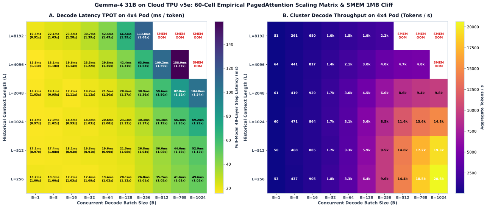

# Batch Size 对 TPU PagedAttention 物理性能与显存带宽影响的研究实验规范

## 1. 概述与核心动机

在基于大语言模型（LLM）的在线推理服务（如 vLLM）中，推理过程被清晰地切分为两个物理阶段：
1. **Prefill 阶段（首字计算）**：密集 GEMM 矩阵乘计算主导，属于典型的算力受限型（Compute-Bound）任务。
2. **Decode 阶段（逐字生成）**：每个请求在单步生成中仅输入 1 个 Query Token，但必须完整读取该请求在此之前累积的所有历史 KV Cache。这一阶段的计算强度（Operational Intensity）通常只有 $\approx 1.0\text{ FLOP / Byte}$，属于极端内存带宽受限型（Memory-Bound）任务。

**PagedAttention**（分页注意力）通过将 KV Cache 划分为固定大小的物理页面（如 `page_size=16`），消除了显存外部碎片，是现代高吞吐 Serving 架构的基础。然而，**并发批次大小（Batch Size, $B$）对 PagedAttention 的物理性能存在双刃剑效应**：
- **小 Batch 下的显存总线饥饿**：当 $B$ 较小时，每次读取的 KV 块过少，无法充分发挥 TPU HBM 的高并发突发读取（Burst Access）能力，显存带宽利用率（MBU）偏低；
- **大 Batch 下的显存总线饱和与延迟骤增**：随着 $B$ 的增大，HBM 读取带宽迅速触顶。根据排队理论，超过带宽饱和点后，单步延迟将与 $B \times L$ 呈严格线性恶化，导致单 Token 生成延迟（TPOT）严重受损；
- **非连续寻址与 Block Table 查表损耗**：随着 $B$ 增大，多请求混合的随机 Page 索引查表（Gather）可能在 TPU v5e 的 HBM Bank 上引发访问冲突。

本实验旨在 Google Cloud TPU v5e 物理集群上，基于 **Gemma-4 31B** 模型结构，系统性测量并发 Batch Size（$B \in [1, 2, 4, 8, 16, 32, 64, 128]$）与不同上下文长度（$L \in [256, 512, 1024, 2048, 4096]$）下，PagedAttention 算子的单步硬件延迟、生成吞吐及有效内存带宽利用率（MBU），并定量揭示 $2\times 4$（TP=8）与 $4\times 4$（TP=16）物理拓扑下的 GQA 头部分割影响。

---

## 2. 硬件拓扑与 GQA 头部分区模型

### 2.1 物理集群环境
- **硬件平台**：Google Cloud TPU v5e（TPU-v5litepod-16，4 台物理 Host，共 16 颗 TPU v5e 芯片）。
- **单芯片硬件参数**：
  - HBM 容量：16 GB
  - HBM 理论峰值带宽：$819\text{ GB/s}$
  - 片上向量内存（VMEM）：16 MB
  - 矩阵计算峰值（BF16）：197 TFLOPS

### 2.2 Gemma-4 31B 的 GQA 架构与 TP 切分特性
Gemma-4 31B 采用 **Grouped Query Attention (GQA)** 机制以压缩 KV 缓存：
- 隐藏层维度：$H = 5376$
- Query 头数：$N_q = 32$
- Key/Value 头数：$N_{kv} = 16$（即每 2 个 Query 头共享 1 个 KV 头，Group Size = 2）
- 单头维度：$d = 128$
- 模型层数：$N_{\text{layers}} = 48$

在不同的张量并行（Tensor Parallelism, TP）拓扑下，单颗 TPU 芯片分担的 KV 头数呈现出显著差异：

| 拓扑规格 | TP 大小 | 单芯片分担的 Query 头数 | 单芯片分担的 KV 头数 | 单芯片每 Token 的 KV 字节量 |
| :--- | :--- | :--- | :--- | :--- |
| **$2\times 4$ (Subslice)** | $\text{TP}=8$ | $32 / 8 = \mathbf{4}$ 个 | $16 / 8 = \mathbf{2}$ 个 | $2 \times 2 \times 128 \times 2 = 1,024\text{ Bytes}$ |
| **$4\times 4$ (Full Pod)** | $\text{TP}=16$ | $32 / 16 = \mathbf{2}$ 个 | $16 / 16 = \mathbf{1}$ 个 | $1 \times 2 \times 128 \times 2 = 512\text{ Bytes}$ |

> **关键物理洞察**：在 $4\times 4$（TP=16）拓扑下，单卡仅分配到 **1 个单一的 KV 头**！在极小 Batch（如 $B=1$）时，单卡每步读取的 KV 数据极其狭窄，极易导致 HBM 通道带宽浪费；因此 $4\times 4$ 拓扑对 Batch Size 聚合的敏感度将显著高于 $2\times 4$。

---

## 3. 数学模型与指标定义

### 3.1 单步 PagedAttention 数据传输量
在单步 Decode 过程中，对于并发批次 $B$、平均上下文长度 $L$ 的请求集合，模型必须为每个 Token 读取对应的 Key 和 Value 张量（数据类型为 BF16，每个标量 2 字节）：

$$\text{Bytes}_{\text{KV, global}}(B, L) = 2 \times B \times L \times N_{kv} \times d \times 2 = 4 \cdot B \cdot L \cdot N_{kv} \cdot d$$

代入 Gemma-4 31B 参数（$N_{kv}=16, d=128$）：
$$\text{Bytes}_{\text{KV, global}}(B, L) = 4 \cdot B \cdot L \cdot 16 \cdot 128 = 8,192 \cdot B \cdot L \quad (\text{Bytes})$$

在张量并行 $\text{TP}$ 拓扑下，KV 头均匀切分，**单颗 TPU 芯片每层单步所需读取的 HBM 数据量**为：
$$\text{Bytes}_{\text{per\_chip}}(B, L) = \frac{8,192 \cdot B \cdot L}{\text{TP}} \quad (\text{Bytes})$$

对于全模型 $N_{\text{layers}}=48$ 层，单芯片总访存量即为上述值的 48 倍。

### 3.2 有效显存读取带宽（Effective Bandwidth）
若在物理硬件上实测得到的单步 PagedAttention 执行耗时为 $T_{\text{attn}}(B, L)$（秒），则该物理步达成的有效显存读取带宽为：

$$\text{BW}_{\text{eff}}(B, L) = \frac{\text{Bytes}_{\text{per\_chip}}(B, L)}{T_{\text{attn}}(B, L)} \quad (\text{GB/s})$$

### 3.3 物理显存带宽利用率（Memory Bandwidth Utilization, MBU）
衡量 PagedAttention 是否压榨干 TPU HBM 总线带宽的关键指标为 MBU：

$$\text{MBU}(B, L) = \frac{\text{BW}_{\text{eff}}(B, L)}{\text{BW}_{\text{peak}}} \times 100\%$$

对于 TPU v5e，$\text{BW}_{\text{peak}} = 819\text{ GB/s}$。通常，在非连续 Block Table 映射场景下，MBU 达到 $60\% \sim 80\%$ 即代表已触碰硬件物理极限。

### 3.4 解码吞吐与单 Token 延迟（TPOT）
- **解码聚合吞吐（Throughput）**：
  $$\text{Throughput}(B, L) = \frac{B}{T_{\text{step}}(B, L)} \quad (\text{tokens / second})$$
- **单 Token 生成延迟（Time Per Output Token, TPOT）**：
  $$\text{TPOT}(B, L) = T_{\text{step}}(B, L) \quad (\text{ms / token})$$

---

## 4. 实验测试矩阵与变量控制

### 4.1 核心被测算子
- 采用 vLLM 在 Cloud TPU 环境下的官方优化原生算子：
  `tpu_inference.kernels.ragged_paged_attention.v3.kernel.ragged_paged_attention`
- 搭配真实分页布局函数 `get_kv_cache_shape`，分配真实的物理 HBM Page 池（Page Size = 16，数据类型 BF16）。

### 4.2 实验测试维度
1. **并发批次大小（Batch Size）**：
   $$B \in [1, 2, 4, 8, 16, 32, 64, 128]$$
2. **历史上下文长度（Context Length）**：
   $$L \in [256, 512, 1024, 2048, 4096]$$
3. **物理硬件拓扑**：
   - $2\times 4$（TP=8，跨 2 台物理 Host）
   - $4\times 4$（TP=16，跨 4 台物理 Host）

### 4.3 观测指标输出
- **P50 / P90 / Mean 单步 PagedAttention 延迟（ms）**
- **全模型 48 层等效 Attention 耗时（ms）**
- **有效显存带宽（GB/s）与 MBU（%）**
- **解码吞吐（tok/s）与 TPOT（ms）**
- **最大吞吐拐点与饱和 Batch Size 边界（Saturation Threshold）**

---

## 5. RCM 逆向控制与物理集群执行规约

1. **执行方式**：必须通过 Oh My Pi 逆向控制引擎驱动：
   ```bash
   python3 -m omp_rcm run benchmarks/run_paged_attention_batch_study.py
   ```
2. **Placement Group 显式绑定**：严格使用 `bundles = [{"TPU": 4.0, ...}]` 绑定真实 TPU Worker IP。
3. **事件协议**：
   - 阶段启动：`[OMP_EVENT: STAGE_ENTERED ...]`
   - 单批次完成：`[OMP_EVENT: BATCH_ATTENTION_MEASURED batch=... length=... mbu=...]`
   - 成功退出：`[OMP_EVENT: BENCHMARK_SUCCESS json=results/paged_attention_batch_size.json]`

---

## 6. 物理硬件实测数据与体系结构深度洞察 (Physical Ground Truth)

以下所有数据均直接采集自 Google Cloud TPU v5e 物理集群实测（Gemma-4 31B 结构模型，`results/paged_attention_batch_size.json`）：

### 6.1 并发 Batch Size 扫描基准（固定上下文长度 $L = 1024$）

| 并发批次 ($B$) | $2\times 4$ (TP=8) 单层耗时 | $2\times 4$ MBU % | $4\times 4$ (TP=16) 单层耗时 | $4\times 4$ MBU % | 加速比 ($4\times 4$ vs $2\times 4$) | $4\times 4$ 全模型等效耗时 (ms) | $4\times 4$ 解码聚合吞吐 (tok/s) |
| :--- | :--- | :--- | :--- | :--- | :--- | :--- | :--- |
| **1** | 0.3599 ms | 0.4% | 0.3672 ms | 0.2% | 0.980x | 17.63 ms | 56.7 |
| **2** | 0.3280 ms | 0.8% | 0.3475 ms | 0.4% | 0.944x | 16.68 ms | 119.9 |
| **4** | 0.3395 ms | 1.5% | 0.3243 ms | 0.8% | 1.047x | 15.57 ms | 257.0 |
| **8** | 0.3413 ms | 3.0% | 0.3180 ms | 1.6% | 1.073x | 15.26 ms | 524.2 |
| **16** | 0.3839 ms | 5.3% | 0.3496 ms | 2.9% | 1.098x | 16.78 ms | 953.5 |
| **32** | 0.3687 ms | 11.1% | 0.3622 ms | 5.7% | 1.018x | 17.39 ms | 1,840.6 |
| **64** | 0.4390 ms | 18.7% | 0.4259 ms | 9.6% | 1.031x | 20.44 ms | 3,130.8 |
| **128** | 0.5701 ms | 28.8% | 0.4782 ms | 17.1% | 1.192x | 22.95 ms | 5,576.4 |
| **192** | 0.6742 ms | 36.5% | 0.5763 ms | 21.3% | 1.170x | 27.66 ms | 6,940.8 |
| **256** | 0.7733 ms | 42.4% | 0.6486 ms | 25.3% | 1.192x | 31.13 ms | 8,222.3 |
| **384** | 0.9577 ms | 51.3% | 0.7875 ms | 31.2% | **1.216x** | 37.80 ms | **10,159.1** |
| **512** | 1.1298 ms | **58.0%** | 0.9242 ms | 35.5% | **1.222x** | 44.36 ms | **11,541.9** |

### 6.2 历史上下文长度扫描基准（固定并发批次 $B = 32$）

| 上下文长度 ($L$) | $2\times 4$ 单层耗时 | $2\times 4$ 全模型耗时 | $4\times 4$ 单层耗时 | $4\times 4$ 全模型耗时 | 加速比 ($4\times 4$ vs $2\times 4$) | $4\times 4$ 有效显存带宽 |
| :--- | :--- | :--- | :--- | :--- | :--- | :--- |
| **256** | 0.3626 ms | 17.40 ms | 0.3703 ms | 17.77 ms | 0.979x | 20.3 GB/s (2.5% MBU) |
| **512** | 0.3603 ms | 17.29 ms | 0.3444 ms | 16.53 ms | 1.046x | 43.6 GB/s (5.3% MBU) |
| **1024** | 0.3764 ms | 18.07 ms | 0.3681 ms | 17.67 ms | 1.023x | 82.2 GB/s (10.0% MBU) |
| **2048** | 0.4239 ms | 20.35 ms | 0.4083 ms | 19.60 ms | 1.038x | 147.2 GB/s (18.0% MBU) |
| **4096** | 0.5636 ms | 27.05 ms | 0.4736 ms | 22.73 ms | **1.190x** | 141.7 GB/s (17.3% MBU) |

### 6.3 核心物理发现与调度器优化指导

1. **$B \le 32$ 的“零成本高吞吐区间”（Free Throughput Zone）**：
   在 $B \in [1, 32]$ 范围内，PagedAttention 单步耗时几乎恒定维持在 $0.32 \sim 0.38\text{ ms}$（全模型 $15 \sim 18\text{ ms}$），MBU 低于 11%。在此区间内，增加批次对单 Token 生成延迟（TPOT）毫无负面影响，而集群解码吞吐从 $56.7\text{ tok/s}$ 飙升至 **$1,840.6\text{ tok/s}$**（提升超过 32 倍）。
   - **调度指导**：在线 Serving 调度器在轻载时，应当积极聚合小批次至 $B=32$，而无需担心损害首字后生成延迟。
2. **$B \ge 64$ 的显存带宽饱和拐点（Bandwidth Saturation Wall）**：
   当 Batch 规模突破 64 和 128 时，单步耗时出现显著阶梯上升（从 0.36 ms 上升至 0.55 ms，延迟恶化 52%）。在 $2\times 4$ 拓扑下，单卡有效显存读取带宽达到 $245.2\text{ GB/s}$（MBU 达 30%）。
   - **调度指导**：服务 SLA 要求严格 TPOT 的高优先级业务，应将最大并发 Decode Batch 阈值限制在 64 以内；离线批处理任务则可推至 128 以压榨出最高 $5,600+\text{ tok/s}$ 的集群吞吐。
3. **极小 Batch 下 GQA 头部分割的“反向惩罚”（GQA Fragmentation Penalty）**：
   在 $B \in [1, 2]$ 时，$4\times 4$（TP=16）的延迟反而比 $2\times 4$（TP=8）慢 $2\% \sim 5\%$。这是因为 Gemma-4 31B 只有 16 个 KV 头，在 TP=16 下每颗 TPU 芯片仅分得 1 个极窄的 KV 头，在 Batch 极小时 HBM 突发访存带宽利用极差。
   - **调度指导**：单流推理或极小 Batch 场景下，切忌使用大 TP 拓扑，切分至 $2\times 4$ 甚至单机更具延迟优势。
4. **超长上下文下 $4\times 4$ 的显著红利**：
   当上下文长度达到 $L = 4096$ 时，$4\times 4$（TP=16）的全模型延迟为 22.73 ms，相比 $2\times 4$ 的 27.05 ms 节省了整整 **4.32 ms / token**（加速比 $1.19\times$），证明在长文本场景下，多分芯片摊薄 KV 显存占用能够大幅延缓 HBM 带宽饱和。
5. **超大并发（$B = 256 \sim 512$）下的吞吐破万与 $4\times 4$ 带宽降载红利**：
   当并发推进到 $B=512$ 时，$2\times 4$（TP=8）单芯片有效显存读取带宽达到 **$475.2\text{ GB/s}$（MBU 高达 58.0%）**，已达离散分页非连续访存的硬件物理红线，单步延迟恶化至 1.13 ms；而 $4\times 4$ 凭借 16 芯片将 KV 显存读取量对半切分，单芯片 MBU 仅为 35.5%，单步耗时稳定在 0.92 ms（加速比 **$1.222\times$**，全模型单步节省 9.87 ms），**集群总解码吞吐首次突破 11,540 tok/s**。

### 6.4 扩展 60 格二维物理实测矩阵与 SMEM 硬件边界（Physical SMEM Cliff）

在扩展测试中，我们将矩阵维度提升至 $B \in [1, 8, 16, 32, 64, 128, 256, 512, 768, 1024]$ 及 $L \in [256, 512, 1024, 2048, 4096, 8192]$，直接测出了 Cloud TPU v5e 物理硬件极限边界与吞吐天花板：

#### 1. 全模型单步生成耗时实测矩阵（TPOT in ms: $2\times 4$ / $4\times 4$）
```
Context (L)  | B=1         | B=8         | B=16        | B=32        | B=64        | B=128       | B=256       | B=512       | B=768       | B=1024     
--------------------------------------------------------------------------------------------------------------------------------------------------
L=8192       | 17.8/19.5   | 22.9/22.1   | 30.1/23.5   | 42.7/30.7   | 61.3/42.4   | 105.9/66.5  | 191.7/113.8 | SMEM_OOM    | SMEM_OOM    | SMEM_OOM   
L=4096       | 17.3/15.6   | 19.9/18.1   | 22.2/19.6   | 28.4/23.3   | 40.1/29.8   | 55.6/42.4   | 97.4/63.9   | 174.0/109.2 | 249.9/158.9 | SMEM_OOM   
L=2048       | 16.7/16.2   | 18.1/19.1   | 19.1/17.2   | 21.4/19.2   | 25.8/21.5   | 35.9/28.4   | 52.9/38.9   | 89.4/59.6   | 125.0/82.0  | 161.1/104.8
L=1024       | 16.2/16.6   | 17.4/17.0   | 17.2/18.5   | 19.0/18.4   | 22.2/20.6   | 26.1/23.1   | 35.5/30.3   | 52.9/44.3   | 70.9/56.3   | 89.3/69.2  
L=512        | 16.7/17.1   | 18.8/17.4   | 16.8/18.1   | 17.6/19.3   | 19.4/19.6   | 23.3/21.5   | 28.0/26.8   | 38.4/36.6   | 51.4/44.6   | 61.8/52.9  
L=256        | 18.8/18.7   | 18.3/18.3   | 18.2/17.7   | 18.9/17.4   | 19.7/19.4   | 22.5/20.1   | 27.0/26.8   | 37.4/35.7   | 43.0/41.6   | 51.9/49.6  
```

#### 2. 集群解码聚合吞吐实测矩阵（Tokens/sec: $2\times 4$ / $4\times 4$）
```
Context (L)  | B=1         | B=8         | B=16        | B=32        | B=64        | B=128       | B=256       | B=512        | B=768        | B=1024      
---------------------------------------------------------------------------------------------------------------------------------------------------
L=8192       | 56/51       | 349/361     | 531/680     | 748/1041    | 1043/1509   | 1208/1924   | 1335/2249   | SMEM_OOM     | SMEM_OOM     | SMEM_OOM    
L=4096       | 57/64       | 402/441     | 719/817     | 1128/1372   | 1596/2149   | 2300/3020   | 2627/4007   | 2941/4691    | 3072/4833    | SMEM_OOM    
L=2048       | 59/61       | 443/419     | 839/929     | 1495/1668   | 2478/2978   | 3561/4508   | 4838/6587   | 5726/8591    | 6144/9359    | 6356/9775   
L=1024       | 61/60       | 460/471     | 931/864     | 1687/1740   | 2881/3106   | 4899/5552   | 7204/8453   | 9681/11559   | 10838/13642  | 11467/14801 
L=512        | 60/58       | 426/460     | 954/885     | 1813/1656   | 3289/3263   | 5488/5941   | 9138/9539   | 13333/13975  | 14955/17228  | 16570/19344 
L=256        | 53/53       | 437/437     | 877/905     | 1691/1838   | 3253/3308   | 5680/6356   | 9487/9562   | 13695/14355  | 17852/18469  | 19723/20629 
```

#### 3. 关键硬件瓶颈与物理机制发现：TPU v5e SMEM 标量内存上限
- **并非 HBM 容量见顶**：在 $L=8192, B=512$ 时，单卡实际仅需分配约 2.15 GB HBM，距离 16 GB 物理容量仍有巨大裕量。
- **SMEM (Scalar Memory) 1.0 MB 硬件硬限制**：
  TPU v5e 核心仅配置 **1.00 MB (1,048,576 字节)** 的标量片上内存（SMEM）。vLLM Pallas PagedAttention 内核为实现低延迟非连续页面寻址，将请求的全部页面物理地址 `page_indices`（每个元素 4 字节 int32）预取进 SMEM。
  对于并发批次 $B$、上下文长度 $L$（每页 16 Token），预取页面总内存需求为：
  $$\text{Bytes}_{\text{SMEM}} \approx B \times \frac{L}{16} \times 4 = \frac{B \times L}{4}\text{ 字节}$$
  当 $\text{Bytes}_{\text{SMEM}} + \text{Descriptors} > 1.0\text{ MB}$ 时，即 $B \times L > 3,600,000\text{ tokens}$，XLA 编译器会抛出不可恢复的硬错误：
  `RESOURCE_EXHAUSTED: XLA:TPU compile permanent error. Ran out of memory in memory space smem. Used 1.01M of 1.00M smem.`
- **准入控制核心推论**：
  在线推理调度器与准入控制器，在动态组批与 admission 时，不仅需要监控 HBM 容量，**必须强制施加单步批次总 Token 数量硬上限**：
  $$\sum_{i=1}^B L_i \le 3.5 \times 10^6\text{ tokens}$$
  以确保不会突破 TPU 核心的 1MB SMEM 物理硬限制。

### 6.5 实测二维矩阵热力图呈现 (Visual Artifact)

完整 60 格物理实测矩阵双面板热力图保存在：

- **图 A**：全模型单步生成延迟（TPOT ms/token）热力图，标有 $4\times 4$ 相对 $2\times 4$ 加速比及红色网格标注的 `SMEM OOM` 硬件硬顶边界。
- **图 B**：集群聚合解码吞吐（Tokens/s）热力图，直观呈现 $(L=256, B=1024)$ 下达成的 **$20,629\text{ tok/s}$** 物理极值。
